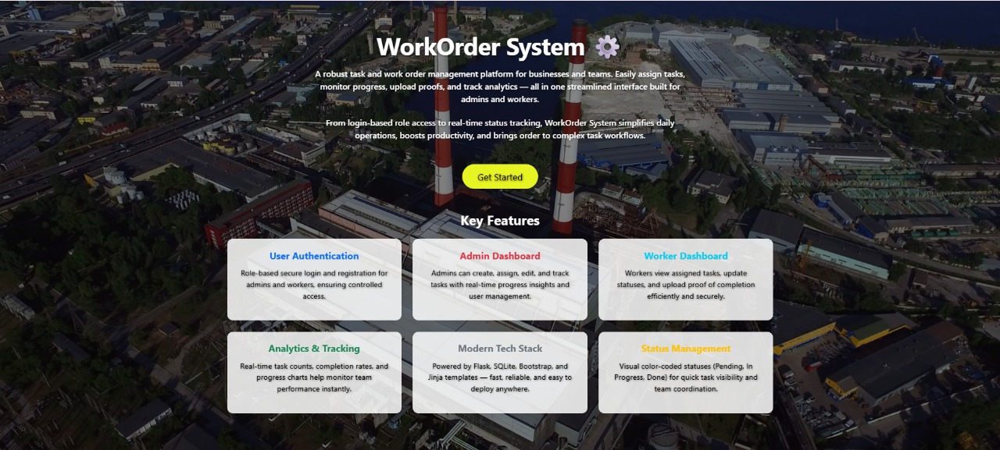

# ⚙️ WorkOrder System

The **WorkOrder System** is a streamlined task and work order management platform designed to simplify operations for admins, workers, and supervisors. It ensures smooth task assignment, tracking, and completion with real-time updates, providing a **user-friendly interface** and **robust backend logic**.

---

## ✨ Features

### 🔐 User Authentication
- Secure login and registration with **role-based access** (Admin & Worker).

### 📋 Admin Dashboard
- Create, update, assign, and delete tasks.  
- Track deadlines and statuses (Pending / In Progress / Done).  
- Manage workers with ease.

### 🧑‍🔧 Worker Dashboard
- View assigned tasks.  
- Update status to **Done** upon completion.

### 🎨 Status Management
- **Pending** = Grey  
- **In Progress** = Blue  
- **Done** = Green  

### 🔔 Notifications
- Flash messages for success & error handling.  
- Engaging alerts for smooth user experience.

---

## 🛠️ Tech Stack

**Frontend**: HTML5, CSS3, Bootstrap 5  
**Backend**: Python (Flask Framework)  
**Database**: SQLite  
**Other Tools**: Jinja2 Templates, Flask Sessions, Flash Messaging  

---

## 📸 Project Preview




## 📂 Folder Structure

```text
WorkOrder-System/
│── app.py
│── README.md
│── requirements.txt
│── workorder.db
│── exported_tasks.xlsx
│
├── database/
│ ├── industry.db
│ └── workorders.db
│
├── static/
│ ├── css/
│ │ ├── style.css
│ │ └── profile.css
│ ├── images/
│ │ └── backgrounds/
│ └── uploads/
│
├── templates/
│ ├── admin_dashboard.html
│ ├── admin_details.html
│ ├── admin_list.html
│ ├── admin_profile.html
│ ├── chat.html
│ ├── create_task.html
│ ├── export_success.html
│ ├── login.html
│ ├── profile.html
│ ├── register.html
│ ├── worker_dashboard.html
│ ├── worker_detail.html
│ └── workers_list.html
│
└── utils/
├── db_init.py
└── export_excel.py
```

<p align="center"> ✨ Maintained by <a href="https://github.com/yashhavalannache">Yash Havalannache</a> ✨ </p> 